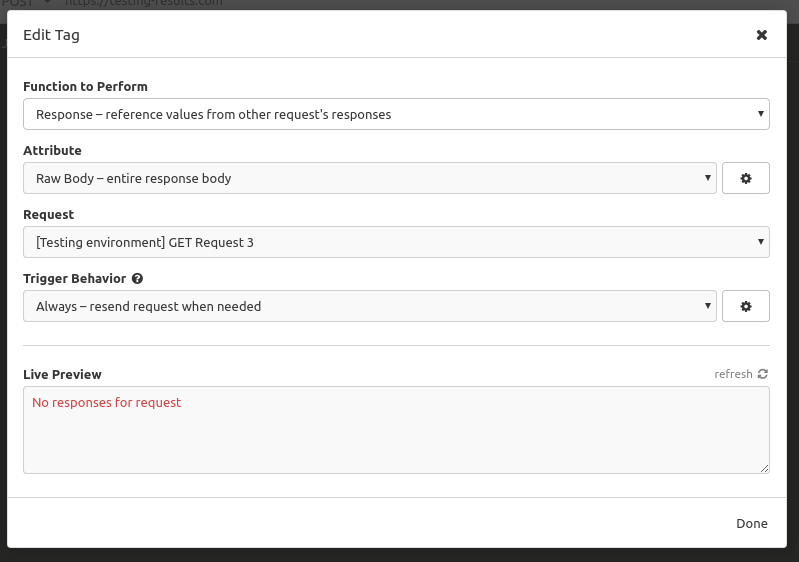

# insomnia-plugin-testing

## Installation
1. Open your preferences in Insomnia
2. Type `insomnia-plugin-testing`
3. Click 'Install Plugin'

# Goal

This plugin is designed to provide a group of functionality that can be configured and used to help test single or multiple requests that are stored in your Insomnia environment. The functionality can also be used seperately to enhance the overall usage of Insomnia.

# Test Request Formatter

This takes a JSON object under an environment defined key and runs through each key in the section to transform the corresponding JSON value into environment defined fields with values derived by JSON paths. This can be used to digest multiple existing requests who have the same response structure through the use of the [Insomnia Chaining Requests](https://support.insomnia.rest/article/43-chaining-requests "Insomnia chaining requests article") with response reference type "Raw Body".

## Usage
The request body is JSON with a key of a reference name and a value of JSON. This can be set up to trigger existing request to run by setting the value JSON to be a Response hook with response reference type of "Raw Body" and trigger behaviour of "Always".

The response field names and value paths are defined in the Insomnia environment. This will be the structure of the value under the key defined by the environment variable "test-group-key".


Request:
```
{
    "Key defined in the Insomnia environment under test-group-key": {
        "Reference name1": JSON1,
        "Reference name2": JSON2,
        "Reference name3": JSON3
    }
}
```

Environment:
```
{
    "TEST_ENV": {
        "test-group-key": "Key under which the JSON object of requests sits",
        "response-structure": {
            "field-name1": "JSON path string",
            "field-name2": "JSON path string",
            "field-name3": "JSON path string"
        }
    }
}
```

## Test Result Assertion

Optional functionality of the test request formatter that allows the value of each field to be compared with another value to see if they are equal. 

### Usage
To turn on, the "assert-equality" environment variable is present and set to true, and next to the field name an array containing first, a JSON path to extract the value to be tested and second, a JSON path to extract the expected value.

In the body of the request, the value of each reference name is set to an array with the JSON to be tested first and a JSON object containing the expected results second. If no expected value JSON given then no assertions are made for that reference. If the JSON path for the testing JSON isn't expected to bring anything back or an empty string, the expected value should be set to "not present".

Optional environmental fields:

__"result-reporting":__

- "DEFAULT" (or unexpected value) returns the unspecified behaviour. The boolean result is added with the key "\[field-name\]-matches".
- "REDUCED" only reports "\[field-name\]-matches"
- "VERBOSE" returns the expected value under the key "\[field-name\]-expected".  

__"report-metrics":__

Set to true wiil add a key of "metrics" under the test group key. The value is a JSON object of "passed-assertions", "failed-assertions", "skipped-values", and "skipped-references" all with totals of those events.

__Equality type__

There is an optional third argument to the field name to sepcify the type of equality to use:
- "DEFAULT" (or unexpected value) stringifies the expected and testing results which are compared through strict equality
- "REGEX" takes the expected value and uses it as a regular expression on the testing value. Both values are expected to be single String arguments
- "CONTAINS" takes the expected value and sees if the testing value contains it. If the expected value is an array, it takes each element in turn and sees if it is contained. Order is not checked.

These can all be prefixed with "NOT" which will invert the assertion.

Request:

```
{
    "Key defined in the Insomnia environment under test-group-key": {
        "Reference name1": [JSON1, expectedJSON1],
        "Reference name2": [JSON2, expectedJSON2],
        "Reference name3": [JSON3, expectedJSON3]
    }
}
```

Environment:

```
{
    "TEST_ENV": {
        "test-group-key": "Key under which the JSON object of requests sits",
        "assert-equality": true,
        "result-reporting": "DEFAULT" / "REDUCED" / "VERBOSE", (optional)
        "report-metrics": true, (optional)
        "response-structure": {
            "field-name1": ["testing JSON path", "expected JSON path" (, "DEFAULT" / "REGEX" / "CONTAINS")],
            "field-name2": ["testing JSON path", "expected JSON path" (, "DEFAULT" / "REGEX" / "CONTAINS")],
            "field-name3": ["testing JSON path", "expected JSON path" (, "DEFAULT" / "REGEX" / "CONTAINS")]
        }
    } 
}
```

# Google Sheet Posting Helper

This will output a given body of JSON to an environment defined Google Sheet. This also comes as a serperate plugin and can be installed using [insomnia-plugin-google-sheets-helper](https://github.com/StuartChartersE22/insomnia-plugin-google-sheets-helper "Google Sheets helper plugin").

## Usage
Allows easy insertion of a JSON structure to a Google sheet whose ID is specified in the Insomnia Environment. The user must set up OAuth 2 token for the Google Sheet API to work. Here are instructions to [authorise on the Google API](https://developers.google.com/sheets/api/guides/authorizing "Google Sheet's Authorisation") and [set up OAuth in Insomnia](https://insomnia.rest/blog/oauth2-github-api/ "Insomnia OAuth setup")

The JSON structure will be converted to key value pairs being in adjacent columns. JSON objects as values will leave space in the key column and populate down the value column. JSON objects will cascade through repeating the pattern described, moving across the columns as the tree gets deeper. Currently limited to maximum right column of ZZ.

Request JSON:

```
{
    "Top": {
        "Child1": "String",
        "Child2": {
            "GrandChild21": "String",
            "GrandChild22": "String"
        },
        "Child3": [GrandChild31,GrandChild32]
    }
}
```
Corresponding sheet layout:

```
----------------------------------------
| Top | Child1 | String       |        |
----------------------------------------
|     | Child2 | GrandChild21 | String |
----------------------------------------
|     |        | GrandChild22 | String |
----------------------------------------
|     | Child3 | GrandChild31 |        |
----------------------------------------
|     |        | GrandChild32 |        |
----------------------------------------
```

The end point must be set to PUT "g-sheet-request\[setting option number\]" for the intended request to be picked up. The actual request URL is automatically generated from the Sheet's ID. It will be the [Google spreadsheets.values.update end point](https://developers.google.com/sheets/api/reference/rest/v4/spreadsheets.values/update).

```
{
    "G_SHEET_HELPER": [
        {
            "sheet-id": "String1",
            "top-left-coord": "A1" (optional)
        },
        {
            "sheet-id": "String2",
            "top-left-coord": "Sheet1!C4" (optional)
        }
    ]
}
```

# Examples

## Example 1:
You have a collection of requests that you have been using to test an end point of your API. You have changed the behaviour of that end point and you want to see what each request now returns:

1. Set up a request that will post your final result to a service to record.


2. Set up the environment variables. For this example we want to return the whole response so the JSON path is just "$".


3. Using the key defined in the TEST_ENV (in this case "test-group"), construct a JSON value with each key being a meaningful description of each request and the value being a Response hook with response reference type "Raw Body" to the corresponding request. If you have run the requests before, there will be a stored result from the previous call and the hook will be blue. Setting the "trigger behaviour" to "Always" will ensure that the request will be sent again and the latest response returned.




4. Clicking send will now trigger the referenced requests to be sent in order from top to bottom and the response JSON to be formed. For this example, the posted result will be:

```
{
    "test-group":{
        "Request 1": {
            "Result": "Request 1 JSON response"
        },
        "Request 2": {
            "Result": "Request 2 JSON response"
        },
        "Request 3": {
            "Result": "Request 3 JSON response"
        }
    }
}
```

## Example 2:
Taking the same situation as above but the response you get back from your end point is quite large. You are quite confident that only a couple of values in your response will be changed. These results can be filered out and returned using the JSON path in the TEST_ENV:

1. Returning to the Insomnia environments variables, the "response-structure" can be modified to give a more refined result. In this example, simple JSON paths have been specified but this works with the full functionality of JSON path.


2. Now sending this request will send a JSON body similar to the old one but now, rather than the whole response under a single key for each reference, there are multiple keys with smaller, more focused values retrieved by the JSON paths. For this example, the posted result will be:

```
{
    "test-group": {
        "Request 1": {
            "Children": "$..child result for Request 1",
            "Name": "$.Name result for Request 1",
            "Version": "$.metadata.version result for Request 1"
        },
        "Request 2": {
            "Children": "$..child result for Request 2",
            "Name": "$.Name result for Request 2",
            "Version": "$.metadata.version result for Request 2"
        },
        "Request 3": {
            "Children": "$..child result for Request 3",
            "Name": "$.Name result for Request 3",
            "Version": "$.metadata.version result for Request 3"
        }
    }
}
```

## Example 3:
You want to perform the previous example but you don't have an end point that you want to post the results to. A useful place to display the results would be in a Google Sheet. Configuring the Google Sheet Helper will allow you to send the results to a sheet in your drive without worrying about formatting the JSON:

1. Before setting up the Insomnia environment variables, make sure you have [authorised your Google API](https://developers.google.com/sheets/api/guides/authorizing "Google Sheet's Authorisation") to allow updating to Google Sheets and the [OAuth token is setup in Insomnia](https://insomnia.rest/blog/oauth2-github-api/ "Insomnia OAuth setup").

2. Now configure the environmental variables to refer to the sheet you want to see the results in.


3. The sheet can be targeted by putting "g-sheet-request\[0\]" in the URL field with a PUT as the method.


4. Sending the request now will update the sheet with the results. For this I have assumed that the children JSON path returns an array.

